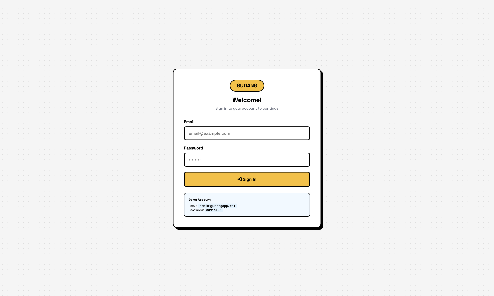
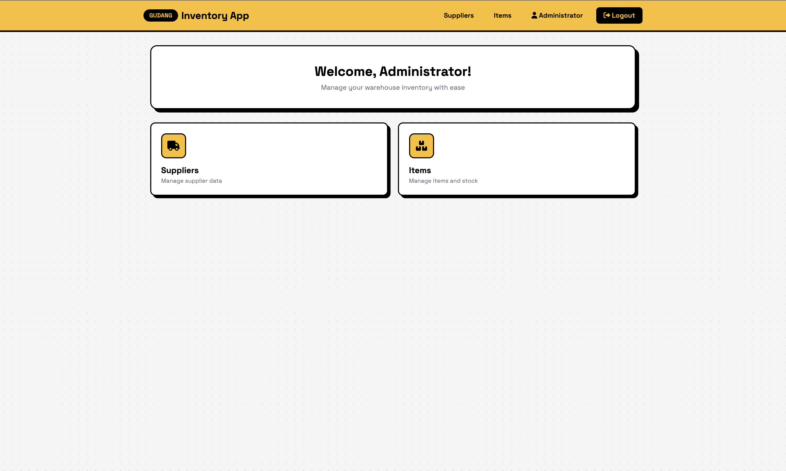
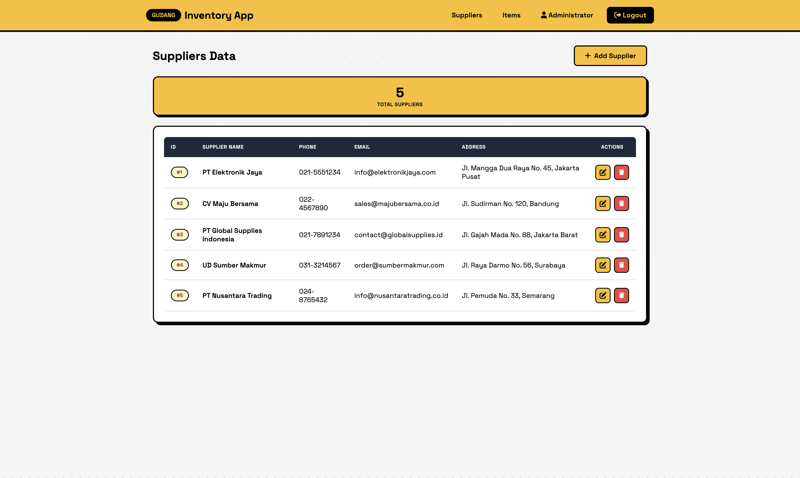
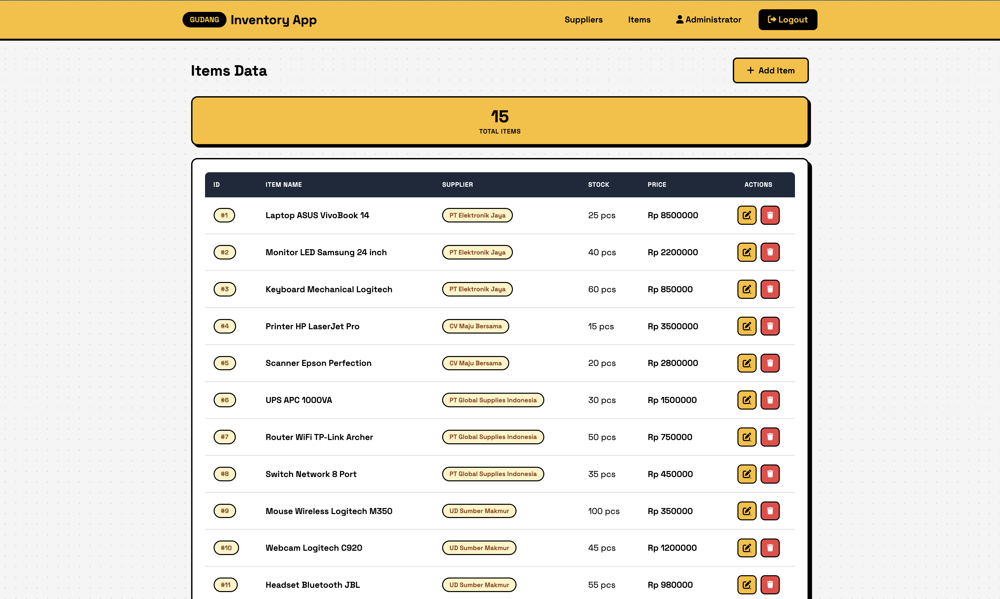

# GudangApp - Inventory Management System

A modern warehouse inventory management application built with NestJS, TypeORM, and Handlebars. This application provides a complete solution for managing suppliers, items, and stock in a warehouse environment.

## Table of Contents

- [Demo Links](#demo-links)
- [Project Overview](#project-overview)
- [Features](#features)
- [Tech Stack](#tech-stack)
- [Database Design](#database-design)
- [Project Structure](#project-structure)
- [Installation](#installation)
- [Configuration](#configuration)
- [Running the Application](#running-the-application)
- [Deployment](#deployment)
- [Available Scripts](#available-scripts)
- [API Endpoints](#api-endpoints)
- [API Testing Reference (Postman)](#api-testing-reference-postman)
- [Screenshots](#screenshots)
- [Troubleshooting](#troubleshooting)
- [Contributing](#contributing)

## Demo Links

| Resource              | Link                                                                                                                     |
| --------------------- | ------------------------------------------------------------------------------------------------------------------------ |
| Postman Documentation | [https://documenter.getpostman.com/view/38960737/2sBXc8o3XY](https://documenter.getpostman.com/view/38960737/2sBXc8o3XY) |

## Project Overview

GudangApp is a full-stack inventory management system designed to help businesses track their warehouse inventory efficiently. The application features:

- **Supplier Management**: Add, edit, and delete supplier information including contact details and addresses
- **Item Management**: Manage inventory items with stock levels, pricing, and supplier associations
- **User Authentication**: Secure login system with session-based authentication
- **Dashboard**: Overview of all inventory operations with quick navigation
- **Auto Seeding**: Automatic database seeding with sample data for development

## Features

- User authentication with bcrypt password hashing
- Session-based login system
- CRUD operations for suppliers and items
- Responsive Neo-Brutalism UI design
- Database auto-synchronization with TypeORM
- Modular seeder system for sample data
- Server-side rendering with Handlebars templates

## Tech Stack

### Backend

| Technology      | Version | Purpose                     |
| --------------- | ------- | --------------------------- |
| NestJS          | ^11.0.1 | Backend framework           |
| TypeORM         | ^0.3.28 | ORM for database operations |
| MySQL2          | ^3.16.3 | MySQL database driver       |
| Express Session | ^1.19.0 | Session management          |
| bcrypt          | ^6.0.0  | Password hashing            |

### Frontend

| Technology       | Version | Purpose         |
| ---------------- | ------- | --------------- |
| Handlebars (hbs) | ^4.2.0  | Template engine |
| Font Awesome     | 6.0.0   | Icons           |
| Space Grotesk    | -       | Typography      |

### Development

| Technology | Version | Purpose              |
| ---------- | ------- | -------------------- |
| TypeScript | ^5.7.3  | Type-safe JavaScript |
| ESLint     | ^9.18.0 | Code linting         |
| Prettier   | ^3.4.2  | Code formatting      |
| Jest       | ^30.0.0 | Testing framework    |

## Database Design

The application uses MySQL with TypeORM. The database consists of three main entities:

### Entity Relationship Diagram

```
┌─────────────────────┐       ┌─────────────────────┐
│       User          │       │      Supplier       │
├─────────────────────┤       ├─────────────────────┤
│ id (PK)             │       │ id (PK)             │
│ name                │       │ name                │
│ email               │       │ phone               │
│ password            │       │ email               │
│ role (enum)         │       │ address             │
│ isActive            │       │ createdAt           │
│ createdAt           │       │ updatedAt           │
│ updatedAt           │       └──────────┬──────────┘
└─────────────────────┘                  │
                                         │ 1:N
                                         │
                              ┌──────────▼──────────┐
                              │        Item         │
                              ├─────────────────────┤
                              │ id (PK)             │
                              │ name                │
                              │ stock               │
                              │ price               │
                              │ supplierId (FK)     │
                              │ createdAt           │
                              │ updatedAt           │
                              └─────────────────────┘
```

### Entity Details

#### User Entity

| Column    | Type     | Description                    |
| --------- | -------- | ------------------------------ |
| id        | INT (PK) | Auto-increment primary key     |
| name      | VARCHAR  | User's full name               |
| email     | VARCHAR  | User's email (unique)          |
| password  | VARCHAR  | Bcrypt hashed password         |
| role      | ENUM     | 'admin' or 'user'              |
| isActive  | BOOLEAN  | Account status (default: true) |
| createdAt | DATETIME | Record creation timestamp      |
| updatedAt | DATETIME | Record update timestamp        |

#### Supplier Entity

| Column    | Type     | Description                |
| --------- | -------- | -------------------------- |
| id        | INT (PK) | Auto-increment primary key |
| name      | VARCHAR  | Supplier company name      |
| phone     | VARCHAR  | Contact phone number       |
| email     | VARCHAR  | Contact email (nullable)   |
| address   | VARCHAR  | Business address           |
| createdAt | DATETIME | Record creation timestamp  |
| updatedAt | DATETIME | Record update timestamp    |

#### Item Entity

| Column     | Type     | Description                |
| ---------- | -------- | -------------------------- |
| id         | INT (PK) | Auto-increment primary key |
| name       | VARCHAR  | Item name                  |
| stock      | INT      | Current stock quantity     |
| price      | INT      | Item price in Rupiah       |
| supplierId | INT (FK) | Reference to Supplier      |
| createdAt  | DATETIME | Record creation timestamp  |
| updatedAt  | DATETIME | Record update timestamp    |

### Relationships

- **Supplier → Item**: One-to-Many (A supplier can have many items)
- **Item → Supplier**: Many-to-One with CASCADE delete (Deleting a supplier removes associated items)

## Project Structure

```
inventory-app/
├── src/
│   ├── items/                  # Items module
│   │   ├── dto/                # Data Transfer Objects
│   │   ├── entities/           # TypeORM entity
│   │   ├── items.controller.ts
│   │   ├── items.module.ts
│   │   └── items.service.ts
│   ├── suppliers/              # Suppliers module
│   │   ├── dto/
│   │   ├── entities/
│   │   ├── suppliers.controller.ts
│   │   ├── suppliers.module.ts
│   │   └── suppliers.service.ts
│   ├── users/                  # Users/Auth module
│   │   ├── dto/
│   │   ├── entities/
│   │   ├── users.controller.ts
│   │   ├── users.module.ts
│   │   └── users.service.ts
│   ├── seeder/                 # Database seeder
│   │   ├── data/               # Seed data files
│   │   │   ├── suppliers.data.ts
│   │   │   ├── items.data.ts
│   │   │   └── index.ts
│   │   ├── services/           # Individual seeders
│   │   │   ├── supplier.seeder.ts
│   │   │   ├── item.seeder.ts
│   │   │   └── index.ts
│   │   ├── seeder.module.ts
│   │   └── seeder.service.ts
│   ├── app.controller.ts
│   ├── app.module.ts
│   ├── app.service.ts
│   └── main.ts
├── views/                      # Handlebars templates
│   ├── items/
│   │   ├── index.hbs
│   │   ├── create.hbs
│   │   └── edit.hbs
│   ├── suppliers/
│   │   ├── index.hbs
│   │   ├── create.hbs
│   │   └── edit.hbs
│   ├── users/
│   │   └── login.hbs
│   ├── dashboard.hbs
│   └── layout.hbs
├── test/                       # Test files
├── .env.example                # Environment variables template
├── package.json
├── tsconfig.json
└── README.md
```

## Installation

### Prerequisites

- Node.js >= 18.x
- pnpm (recommended) or npm
- MySQL >= 8.0

### Steps

1. **Clone the repository**

   ```bash
   git clone https://github.com/salmanabdurrahman/inventory-app
   cd inventory-app
   ```

2. **Install dependencies**

   ```bash
   pnpm install
   # or
   npm install
   ```

3. **Create MySQL database**

   ```sql
   CREATE DATABASE inventory_db;
   ```

4. **Configure environment variables**
   ```bash
   cp .env.example .env
   ```
   Edit `.env` with your database credentials.

## Configuration

Create a `.env` file in the root directory:

```env
# Database Configuration
DB_HOST=localhost
DB_PORT=3306
DB_USERNAME=root
DB_PASSWORD=your_password
DB_DATABASE=inventory_db

# Application Configuration
PORT=3000
SESSION_SECRET=your_random_session_secret
NODE_ENV=development
```

### Configuration Options

| Variable       | Description                   | Default      |
| -------------- | ----------------------------- | ------------ |
| DB_HOST        | MySQL server hostname         | localhost    |
| DB_PORT        | MySQL server port             | 3306         |
| DB_USERNAME    | MySQL username                | root         |
| DB_PASSWORD    | MySQL password                | -            |
| DB_DATABASE    | Database name                 | inventory_db |
| PORT           | Application port              | 3000         |
| SESSION_SECRET | Secret for session encryption | -            |
| NODE_ENV       | Environment mode              | development  |

## Running the Application

### Development Mode

```bash
pnpm run start:dev
# or
npm run start:dev
```

The application will be available at `http://localhost:3000`

### Production Mode

```bash
pnpm run build
pnpm run start:prod
# or
npm run build
npm run start:prod
```

### Debug Mode

```bash
pnpm run start:debug
```

## Deployment

### Deploying to VPS (Ubuntu)

This guide covers deploying the application to a VPS running Ubuntu.

#### Prerequisites

- Ubuntu VPS (20.04 or later)
- Domain name (optional, for SSL)
- MySQL/MariaDB database or TiDB Cloud

#### Step 1: Server Setup

```bash
# Update system
sudo apt update && sudo apt upgrade -y

# Install Node.js 20.x
curl -fsSL https://deb.nodesource.com/setup_20.x | sudo -E bash -
sudo apt install -y nodejs

# Install pnpm
npm install -g pnpm

# Install PM2 (process manager)
npm install -g pm2

# Install Nginx (optional, for reverse proxy)
sudo apt install -y nginx
```

#### Step 2: Clone and Setup Application

```bash
# Clone repository
cd /var/www
sudo git clone https://github.com/yourusername/inventory-app.git
cd inventory-app

# Set ownership
sudo chown -R $USER:$USER /var/www/inventory-app

# Install dependencies
pnpm install

# Build application
pnpm run build
```

#### Step 3: Configure Environment

```bash
# Create production environment file
cp .env.example .env.production

# Edit with your database credentials
nano .env.production
```

Required environment variables:

| Variable         | Description                 |
| ---------------- | --------------------------- |
| `NODE_ENV`       | `production`                |
| `PORT`           | `3000` (or your preferred)  |
| `DB_HOST`        | Database host               |
| `DB_PORT`        | Database port               |
| `DB_USERNAME`    | Database username           |
| `DB_PASSWORD`    | Database password           |
| `DB_DATABASE`    | Database name               |
| `SESSION_SECRET` | Random 32+ character string |

#### Step 4: Run with PM2

```bash
# Start application
pm2 start dist/main.js --name inventory-app

# Save PM2 configuration
pm2 save

# Enable auto-start on reboot
pm2 startup
```

#### Step 5: Configure Nginx (Recommended)

```bash
# Create Nginx config
sudo nano /etc/nginx/sites-available/inventory-app
```

Add this configuration:

```nginx
server {
    listen 80;
    server_name your-domain.com;

    location / {
        proxy_pass http://localhost:3000;
        proxy_http_version 1.1;
        proxy_set_header Upgrade $http_upgrade;
        proxy_set_header Connection 'upgrade';
        proxy_set_header Host $host;
        proxy_set_header X-Real-IP $remote_addr;
        proxy_cache_bypass $http_upgrade;
    }
}
```

Enable the site:

```bash
sudo ln -s /etc/nginx/sites-available/inventory-app /etc/nginx/sites-enabled/
sudo nginx -t
sudo systemctl restart nginx
```

#### Step 6: SSL Certificate (Optional)

```bash
# Install Certbot
sudo apt install -y certbot python3-certbot-nginx

# Generate SSL certificate
sudo certbot --nginx -d your-domain.com
```

#### Useful PM2 Commands

| Command                     | Description            |
| --------------------------- | ---------------------- |
| `pm2 status`                | View running processes |
| `pm2 logs inventory-app`    | View application logs  |
| `pm2 restart inventory-app` | Restart application    |
| `pm2 stop inventory-app`    | Stop application       |

#### Important Notes

- **Firewall**: Open ports 80, 443, and 22 (SSH)
- **SSL/TLS**: Use TLS for database connections in production
- **Sessions**: Consider Redis for session storage in production

## Available Scripts

| Script        | Description                         |
| ------------- | ----------------------------------- |
| `start`       | Start the application               |
| `start:dev`   | Start with hot-reload (development) |
| `start:debug` | Start with debugging enabled        |
| `start:prod`  | Start production build              |
| `build`       | Build the application               |
| `format`      | Format code with Prettier           |
| `lint`        | Run ESLint                          |
| `test`        | Run unit tests                      |
| `test:watch`  | Run tests in watch mode             |
| `test:cov`    | Run tests with coverage             |
| `test:e2e`    | Run end-to-end tests                |

## API Endpoints

### Authentication

| Method | Endpoint        | Description   |
| ------ | --------------- | ------------- |
| GET    | `/users/login`  | Login page    |
| POST   | `/users/login`  | Process login |
| GET    | `/users/logout` | Logout user   |

### Dashboard

| Method | Endpoint | Description    |
| ------ | -------- | -------------- |
| GET    | `/`      | Dashboard page |

### Suppliers

| Method | Endpoint              | Description          |
| ------ | --------------------- | -------------------- |
| GET    | `/suppliers`          | List all suppliers   |
| GET    | `/suppliers/create`   | Create supplier form |
| POST   | `/suppliers`          | Create new supplier  |
| GET    | `/suppliers/:id/edit` | Edit supplier form   |
| PUT    | `/suppliers/:id`      | Update supplier      |
| DELETE | `/suppliers/:id`      | Delete supplier      |

### Items

| Method | Endpoint          | Description      |
| ------ | ----------------- | ---------------- |
| GET    | `/items`          | List all items   |
| GET    | `/items/create`   | Create item form |
| POST   | `/items`          | Create new item  |
| GET    | `/items/:id/edit` | Edit item form   |
| PUT    | `/items/:id`      | Update item      |
| DELETE | `/items/:id`      | Delete item      |

## API Testing Reference (Postman)

The following table provides detailed information for testing API endpoints using Postman or similar tools.

### Authentication Endpoints

| Method | Endpoint        | Content-Type                        | Request Body                                  | Description                          |
| ------ | --------------- | ----------------------------------- | --------------------------------------------- | ------------------------------------ |
| POST   | `/users/login`  | `application/x-www-form-urlencoded` | `email=admin@gudangapp.com&password=admin123` | Authenticate user and create session |
| GET    | `/users/logout` | -                                   | -                                             | Destroy session and logout           |

### Supplier Endpoints

| Method | Endpoint         | Content-Type                        | Request Body | Description                   |
| ------ | ---------------- | ----------------------------------- | ------------ | ----------------------------- |
| GET    | `/suppliers`     | -                                   | -            | Get all suppliers (HTML page) |
| POST   | `/suppliers`     | `application/x-www-form-urlencoded` | See below    | Create new supplier           |
| PUT    | `/suppliers/:id` | `application/x-www-form-urlencoded` | See below    | Update existing supplier      |
| DELETE | `/suppliers/:id` | -                                   | -            | Delete supplier by ID         |

**Create/Update Supplier Body:**

```
name=PT Example Company
phone=021-1234567
email=contact@example.com
address=Jl. Example Street No. 123, Jakarta
```

| Field   | Type   | Required | Description           |
| ------- | ------ | -------- | --------------------- |
| name    | string | Yes      | Supplier company name |
| phone   | string | Yes      | Contact phone number  |
| email   | string | No       | Contact email address |
| address | string | Yes      | Business address      |

### Item Endpoints

| Method | Endpoint     | Content-Type                        | Request Body | Description               |
| ------ | ------------ | ----------------------------------- | ------------ | ------------------------- |
| GET    | `/items`     | -                                   | -            | Get all items (HTML page) |
| POST   | `/items`     | `application/x-www-form-urlencoded` | See below    | Create new item           |
| PUT    | `/items/:id` | `application/x-www-form-urlencoded` | See below    | Update existing item      |
| DELETE | `/items/:id` | -                                   | -            | Delete item by ID         |

**Create/Update Item Body:**

```
name=Laptop ASUS ROG
stock=50
price=15000000
supplierId=1
```

| Field      | Type   | Required | Description              |
| ---------- | ------ | -------- | ------------------------ |
| name       | string | Yes      | Item name                |
| stock      | number | Yes      | Stock quantity (min: 0)  |
| price      | number | Yes      | Price in Rupiah (min: 0) |
| supplierId | number | Yes      | Reference to supplier ID |

### Testing Notes

1. **Session-based Auth**: This application uses session-based authentication. In Postman, enable "Cookie" management to maintain sessions across requests.
2. **Content-Type**: All POST requests use `application/x-www-form-urlencoded` format (HTML form submissions).
3. **CSRF Protection**: Currently not implemented, so direct API testing works without CSRF tokens.
4. **Redirects**: Most POST endpoints redirect to list pages after successful operations. In Postman, disable "Follow Redirects" to see the 302 response.

## Screenshots

### Login Page



### Dashboard



### Suppliers List



### Items List



## Default Credentials

After initial setup, the seeder will create a default admin user:

| Field    | Value               |
| -------- | ------------------- |
| Email    | admin@gudangapp.com |
| Password | admin123            |

## Troubleshooting

### Common Issues

1. **Database Connection Error**
   - Ensure MySQL is running
   - Verify credentials in `.env` file
   - Check if database exists

2. **Port Already in Use**
   - Change the PORT in `.env`
   - Kill the process using the port: `lsof -ti:3000 | xargs kill`

3. **Module Not Found**
   - Run `pnpm install` to ensure all dependencies are installed
   - Delete `node_modules` and reinstall

4. **TypeORM Sync Issues**
   - Set `synchronize: true` in `app.module.ts` for development
   - For production, use migrations instead

### Logs

Check the console output for detailed error messages. The application uses NestJS Logger for structured logging.

## Contributing

1. Fork the repository
2. Create a feature branch: `git checkout -b feature/new-feature`
3. Commit changes: `git commit -m 'Add new feature'`
4. Push to branch: `git push origin feature/new-feature`
5. Submit a Pull Request

### Code Style

- Follow TypeScript best practices
- Use ESLint and Prettier configurations provided
- Write descriptive commit messages
- Add JSDoc comments for public methods

## License

This project is UNLICENSED - see the package.json for details.

**Built with NestJS** by the development team.
